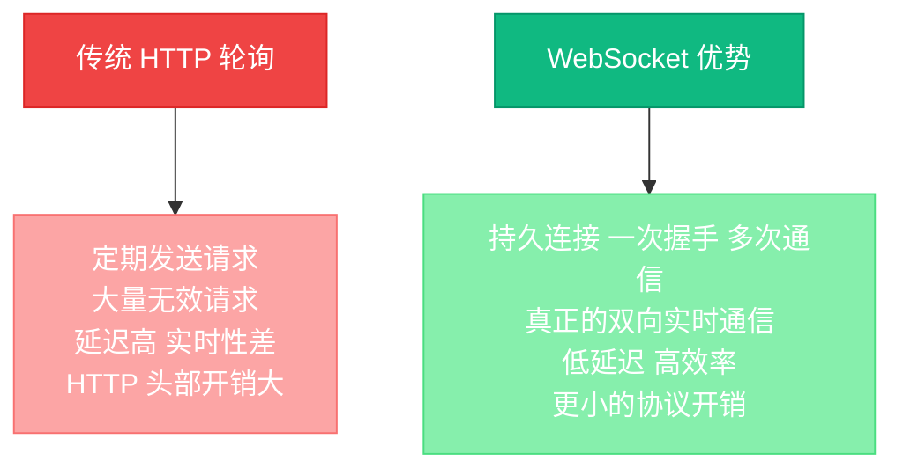
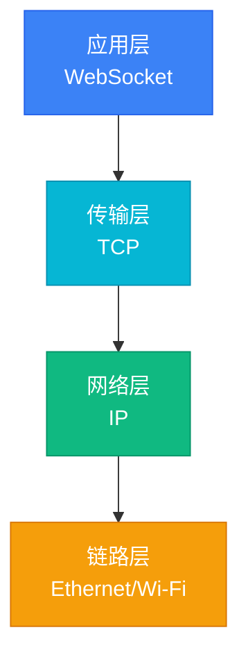
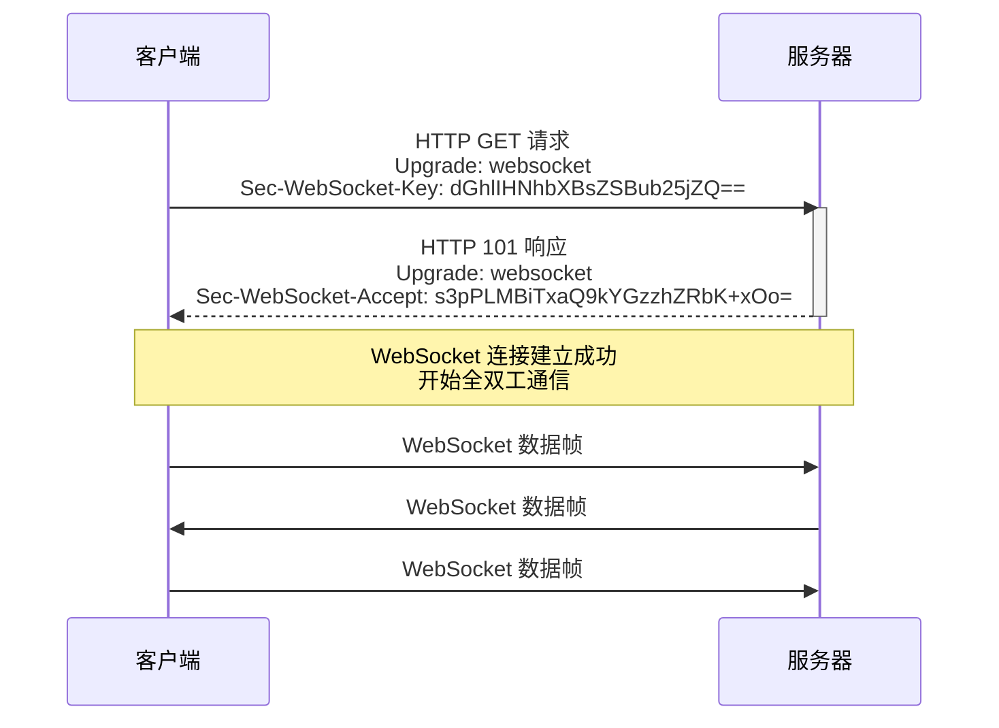
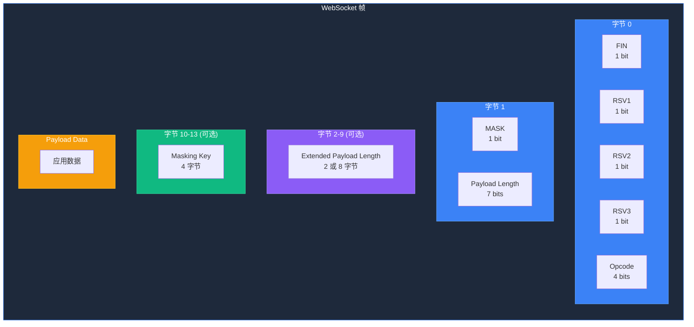
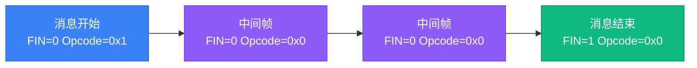

# WebSocket 协议详解：从零到精通的实时通信指南

## 引言

在现代 Web 应用开发中，实时通信已成为不可或缺的功能。无论是即时聊天、在线协作、实时数据监控，还是多人在线游戏，都需要服务器和客户端之间能够高效、实时地交换数据。传统的 HTTP 协议虽然成熟稳定，但在实时性方面存在天然的局限性。WebSocket 协议的出现，彻底改变了这一局面，为 Web 应用提供了真正的双向实时通信能力。

本文将从开发人员的角度，深入剖析 WebSocket 协议的原理、实现细节以及实际应用场景，帮助读者全面掌握这一重要的网络通信技术。

## 一、什么是 WebSocket？

WebSocket 是一种在单个 TCP 连接上进行全双工通信的协议。它于 2011 年被互联网工程任务组（IETF）正式标准化为 RFC 6455，其设计目标是在 Web 浏览器和服务器之间提供实时、双向的数据传输能力。

与传统的 HTTP 请求-响应模式不同，WebSocket 在建立连接后，客户端和服务器可以随时向对方发送数据，无需等待对方的请求。这种全双工通信模式极大地提高了实时应用的性能和用户体验。

WebSocket 协议建立在 TCP 协议之上，默认使用 80 端口（WS）或 443 端口（WSS）。它可以轻松穿越防火墙和代理服务器，与现有的 Web 基础设施完美集成。

## 二、为什么需要 WebSocket？

在深入了解 WebSocket 之前，我们需要先理解传统实时通信方案的局限性，这样才能更好地体会 WebSocket 的价值。

### 2.1 传统 HTTP 轮询的痛点

在 WebSocket 出现之前，实现实时通信的主流方案是 HTTP 轮询。客户端每隔一定时间向服务器发送请求，询问是否有新数据。这种方法存在明显的问题：

- **客户端定期发送请求**：即使没有新数据，客户端也需要不断发起请求，造成不必要的网络流量消耗。
- **大量无效请求**：很多请求返回的是空响应，浪费了服务器资源和网络带宽。
- **延迟高，实时性差**：轮询间隔的存在意味着数据更新到客户端之间存在延迟，无法满足严格的实时性要求。
- **HTTP 头部开销大**：每次请求都需要携带完整的 HTTP 头部，包括 Cookie、User-Agent 等信息，增加了额外的数据传输量。

### 2.2 WebSocket 的革命性优势

WebSocket 通过以下方式彻底解决了上述问题：



- **持久连接，一次握手，多次通信**：WebSocket 连接建立后可以一直保持打开状态，客户端和服务器可以在同一个连接上反复交换数据，避免了重复建立连接的开销。
- **真正的双向实时通信**：连接建立后，客户端和服务器都可以主动向对方发送消息，实现了真正的全双工通信。
- **低延迟，高效率**：数据可以直接通过连接发送，无需等待请求-响应周期，大大降低了延迟。同时，WebSocket 的协议头部非常小，提高了数据传输效率。
- **更小的协议开销**：WebSocket 帧的头部只有 2-14 字节，相比 HTTP 头部动辄几百字节的开销，效率提升显著。

## 三、WebSocket 的核心特性

WebSocket 协议拥有许多优秀的特性，使其成为实时通信的理想选择：

### 3.1 全双工通信

WebSocket 最核心的特性是全双工通信。在传统的半双工通信中，同一时间只能有一方发送数据，另一方接收。而全双工通信允许双方同时发送和接收数据，就像打电话一样，双方可以同时说话和聆听。

### 3.2 基于 TCP

WebSocket 建立在可靠的 TCP 协议之上，默认使用 80 端口（WS）或 443 端口（WSS）。这意味着它可以像普通的 HTTP 流量一样穿越防火墙和代理服务器，无需特殊配置。

### 3.3 持久连接

WebSocket 连接建立后会保持开放状态，除非客户端或服务器主动关闭连接。这种持久连接机制避免了重复建立连接的开销，提高了通信效率。

### 3.4 轻量级

WebSocket 的协议设计非常精简，帧头部只有 2-14 字节，数据传输效率高。相比之下，HTTP 每次请求都需要携带完整的头部信息，开销较大。

### 3.5 跨域支持

WebSocket 天然支持跨域通信，无需像 CORS 那样进行复杂的配置。只要服务器接受连接，不同域名的客户端都可以建立 WebSocket 连接。

### 3.6 安全支持

WebSocket 支持 WSS（WebSocket Secure）加密传输，基于 TLS/SSL 协议，确保数据在传输过程中的安全性。这对于处理敏感信息的实时应用尤为重要。

## 四、WebSocket 的协议层次

WebSocket 协议位于应用层，它依赖于传输层的 TCP 协议。了解 WebSocket 在协议栈中的位置，有助于我们更好地理解其工作原理。



- **应用层**：WebSocket 协议在这一层工作，负责数据的封装和解析。
- **传输层**：TCP 协议提供可靠的、面向连接的字节流传输服务。
- **网络层**：IP 协议负责数据包的路由和转发。
- **链路层**：负责在物理介质上传输数据帧。

## 五、WebSocket 握手过程

WebSocket 连接的建立通过 HTTP 升级机制完成。这个过程被称为"握手"（Handshake），是 WebSocket 连接建立的第一步。

### 5.1 握手流程详解



握手过程分为以下步骤：

1. **客户端发起请求**：客户端发送一个 HTTP GET 请求，请求中包含特殊的头部字段，表明希望将连接升级为 WebSocket 协议。

2. **服务器响应**：服务器收到请求后，验证请求的有效性，如果同意升级，则返回 HTTP 101 Switching Protocols 响应。

3. **连接建立**：一旦收到 101 响应，HTTP 连接就升级为 WebSocket 连接，双方可以开始通过 WebSocket 协议进行全双工通信。

### 5.2 客户端请求示例

```http
GET /chat HTTP/1.1
Host: server.example.com
Upgrade: websocket
Connection: Upgrade
Sec-WebSocket-Key: dGhlIHNhbXBsZSBub25jZQ==
Origin: http://example.com
Sec-WebSocket-Version: 13
```

### 5.3 服务器响应示例

```http
HTTP/1.1 101 Switching Protocols
Upgrade: websocket
Connection: Upgrade
Sec-WebSocket-Accept: s3pPLMBiTxaQ9kYGzzhZRbK+xOo=
```

### 5.4 关键头部字段说明

| 字段名 | 作用 |
|--------|------|
| `Upgrade` | 指示协议升级为 websocket |
| `Connection` | 指示连接状态需要升级 |
| `Sec-WebSocket-Key` | 客户端发送的随机字符串，用于安全验证 |
| `Sec-WebSocket-Accept` | 服务器对 Key 的确认响应 |
| `Sec-WebSocket-Version` | WebSocket 协议版本，当前为 13 |

### 5.5 握手的安全性

WebSocket 握手过程中使用了 `Sec-WebSocket-Key` 和 `Sec-WebSocket-Accept` 机制来确保连接的安全性。服务器会接收客户端发送的 `Sec-WebSocket-Key`，将其与一个特定的 GUID（"258EAFA5-E914-47DA-95CA-C5AB0DC85B11"）拼接后进行 SHA-1 哈希，然后进行 Base64 编码，生成 `Sec-WebSocket-Accept` 值返回给客户端。客户端验证这个值是否正确，从而防止连接被恶意劫持。

## 六、WebSocket 数据帧结构

WebSocket 数据传输使用帧（Frame）作为基本单位。每个帧包含头部和负载两部分，头部包含控制信息，负载包含实际的应用数据。

### 6.1 帧格式详解



### 6.2 字段详细说明

#### FIN（1 bit）

FIN（Finish）字段标识是否为消息的最后一个帧。值为 1 表示这是消息的最后一个帧，值为 0 表示还有后续帧。当一条消息需要分成多个帧传输时，只有最后一个帧的 FIN 标志位为 1。

#### RSV1, RSV2, RSV3（各 1 bit）

这三个是保留位（Reserved），通常设置为 0。它们为未来协议扩展预留了空间，可以用于定义新的功能或特性。

#### Opcode（4 bits）

Opcode（操作码）字段定义了帧的类型，不同的 Opcode 表示不同的数据类型或控制操作：

- `0x0`：连续帧，表示这是消息的后续帧
- `0x1`：文本帧，负载包含 UTF-8 编码的文本数据
- `0x2`：二进制帧，负载包含二进制数据
- `0x3-0x7`：保留用于未来的非控制帧
- `0x8`：关闭连接，用于优雅地关闭 WebSocket 连接
- `0x9`：Ping，用于心跳检测
- `0xA`：Pong，对 Ping 的响应
- `0xB-0xF`：保留用于未来的控制帧

#### MASK（1 bit）

MASK 字段标识负载是否经过掩码（Masking）处理。客户端发送的帧必须将 MASK 设置为 1，服务器发送的帧必须将 MASK 设置为 0。掩码机制是为了防止缓存污染攻击（Cache Poisoning）。

#### Payload Length（7 bits / 7+16 bits / 7+64 bits）

Payload Length 字段表示负载（Payload）的长度。这个字段的编码方式比较特殊，支持三种情况：

- **0-125**：这 7 位的值就是实际的负载长度
- **126**：后续 2 字节（16 位）表示负载长度，最大支持 65535 字节
- **127**：后续 8 字节（64 位）表示负载长度，最大支持 2^63-1 字节

这种设计使得小消息的头部开销最小，同时也能支持超大消息的传输。

#### Masking Key（4 bytes）

当 MASK=1 时，Masking Key 字段存在，它是一个 4 字节的随机值，用于对负载数据进行异或运算。客户端发送的帧必须使用掩码，服务器接收后会使用同样的掩码对数据进行解码。

#### Payload Data

Payload Data 字段包含实际的应用数据。如果使用了掩码，这部分数据在传输前会与 Masking Key 进行异或运算。接收方使用相同的 Masking Key 再次进行异或运算，就可以还原出原始数据。

### 6.3 消息分片

WebSocket 支持将大消息拆分成多个帧传输。这在处理大文件或流式数据时非常有用。分片机制通过 FIN 标志和 Opcode 配合实现：



- 第一个帧：FIN=0, Opcode!=0（通常为 0x1 表示文本或 0x2 表示二进制）
- 中间帧：FIN=0, Opcode=0
- 最后一个帧：FIN=1, Opcode=0

### 6.4 控制帧

控制帧用于连接管理，具有特殊的意义，不能分片传输。WebSocket 定义了三种控制帧：

1. **Close（0x8）**：用于优雅地关闭 WebSocket 连接。Close 帧可以包含状态码和原因字符串，帮助双方理解关闭的原因。

2. **Ping（0x9）**：用于心跳检测。发送方期望收到一个 Pong 响应，以确认连接仍然活跃。如果长时间没有收到 Pong 响应，可以认为连接已断开。

3. **Pong（0xA）**：对 Ping 帧的响应。Pong 帧应该包含与 Ping 帧相同的应用数据，这样发送方可以匹配请求和响应。

## 七、WebSocket 的常见应用场景

WebSocket 协议的实时性和双向通信特性，使其在许多应用场景中都能发挥重要作用。

### 7.1 实时聊天

即时通讯应用是 WebSocket 最典型的应用场景。无论是群聊、私聊，还是消息推送，WebSocket 都能提供低延迟的消息传输，确保用户实时接收消息。相比传统的轮询方式，WebSocket 能够显著降低服务器负载，提升用户体验。

### 7.2 实时数据监控

在服务器监控、股票行情、IoT 设备状态等场景中，需要实时推送数据更新。WebSocket 可以高效地将数据变化推送给所有订阅的客户端，无需客户端不断轮询服务器。这种模式特别适合数据更新频繁的场景。

### 7.3 在线游戏

多人在线游戏需要低延迟、高频率的状态同步。WebSocket 的全双工特性非常适合游戏场景，支持实时的玩家位置、动作等数据交换。相比 HTTP 轮询，WebSocket 能够大幅减少延迟，提供更流畅的游戏体验。

### 7.4 协作编辑

类似 Google Docs 的实时协作编辑工具，需要多个用户同时编辑文档，并实时同步光标位置和内容变化。WebSocket 的实时双向通信能力使得协作编辑成为可能，用户可以看到其他用户的编辑操作，实现真正的实时协作。

### 7.5 推送通知

系统通知、提醒、消息推送等场景非常适合使用 WebSocket。服务器可以主动向客户端推送消息，无需客户端轮询。这不仅提高了实时性，还减少了不必要的网络请求和服务器负载。

### 7.6 音视频通话

WebRTC 等音视频通信技术使用 WebSocket 进行信令交换，建立媒体连接。WebSocket 负责传递连接信息和控制指令，而实际的媒体数据通过 UDP 协议传输。这种架构充分发挥了 WebSocket 的实时性优势。

## 八、WebSocket 的 Python 实现

Python 提供了多个 WebSocket 库，其中 `websockets` 是最受欢迎的异步实现。下面我们通过几个示例来学习如何在 Python 中使用 WebSocket。

### 8.1 简单的 Echo 服务器

```python
# 安装依赖: pip install websockets
import asyncio
import websockets
import json

async def echo_server(websocket):
    """处理客户端连接"""
    print(f"客户端已连接: {websocket.remote_address}")

    try:
        async for message in websocket:
            # 解析消息
            try:
                data = json.loads(message)
                print(f"收到消息: {data}")

                # 处理消息
                response = {
                    "type": "echo",
                    "data": data,
                    "timestamp": asyncio.get_event_loop().time()
                }

                # 发送响应
                await websocket.send(json.dumps(response))

            except json.JSONDecodeError:
                # 非JSON消息，直接回显
                await websocket.send(f"Echo: {message}")

    except websockets.exceptions.ConnectionClosed:
        print(f"客户端断开连接: {websocket.remote_address}")

async def main():
    """启动服务器"""
    print("WebSocket 服务器启动在 ws://localhost:8765")

    async with websockets.serve(echo_server, "localhost", 8765):
        await asyncio.Future()  # 永久运行

if __name__ == "__main__":
    asyncio.run(main())
```

这个示例创建了一个简单的 Echo 服务器，它会将客户端发送的消息原样返回。服务器使用 asyncio 实现异步处理，能够高效地处理多个并发连接。

### 8.2 WebSocket 客户端

```python
import asyncio
import websockets
import json

async def websocket_client():
    """WebSocket 客户端示例"""
    uri = "ws://localhost:8765"

    try:
        async with websockets.connect(uri) as websocket:
            print(f"已连接到服务器: {uri}")

            # 发送消息
            messages = [
                {"type": "greeting", "message": "Hello, Server!"},
                {"type": "data", "value": 42},
                {"type": "ping", "timestamp": 1234567890}
            ]

            for msg in messages:
                await websocket.send(json.dumps(msg))
                print(f"发送: {msg}")

                # 接收响应
                response = await websocket.recv()
                print(f"接收: {response}\n")

                # 短暂延迟
                await asyncio.sleep(1)

    except Exception as e:
        print(f"连接错误: {e}")

if __name__ == "__main__":
    asyncio.run(websocket_client())
```

客户端示例展示了如何连接到 WebSocket 服务器，发送和接收消息。代码使用 `async with` 语法确保连接在使用后正确关闭。

### 8.3 广播服务器

```python
import asyncio
import websockets
import json

# 存储所有连接的客户端
connected_clients = set()

async def broadcast(message):
    """向所有客户端广播消息"""
    if connected_clients:
        websockets.broadcast(connected_clients, message)
        print(f"广播消息给 {len(connected_clients)} 个客户端")

async def handle_client(websocket):
    """处理客户端连接"""
    connected_clients.add(websocket)
    print(f"客户端连接: {websocket.remote_address}, 总数: {len(connected_clients)}")

    try:
        async for message in websocket:
            data = json.loads(message)
            print(f"收到消息: {data}")

            # 广播给所有客户端
            await broadcast(json.dumps({
                "type": "broadcast",
                "from": str(websocket.remote_address),
                "data": data
            }))

    except websockets.exceptions.ConnectionClosed:
        print(f"客户端断开: {websocket.remote_address}")
    finally:
        connected_clients.remove(websocket)
        print(f"客户端移除, 剩余: {len(connected_clients)}")

async def main():
    """启动广播服务器"""
    print("广播服务器启动在 ws://localhost:8765")

    async with websockets.serve(handle_client, "localhost", 8765):
        await asyncio.Future()

if __name__ == "__main__":
    asyncio.run(main())
```

广播服务器示例展示了如何实现一个聊天室，其中一个客户端发送的消息会被广播给所有其他连接的客户端。这是实时聊天应用的核心功能。

## 九、WebSocket 的 Go 实现

Go 语言的 `gorilla/websocket` 库是最流行的 WebSocket 实现，它提供了丰富的功能和良好的性能。下面我们来看几个 Go 语言的实现示例。

### 9.1 简单的 Echo 服务器

```go
// 安装依赖: go get github.com/gorilla/websocket
package main

import (
    "encoding/json"
    "log"
    "net/http"
    "time"

    "github.com/gorilla/websocket"
)

// WebSocket 升级器
var upgrader = websocket.Upgrader{
    ReadBufferSize:  1024,
    WriteBufferSize: 1024,
    CheckOrigin: func(r *http.Request) bool {
        return true // 生产环境需要验证 Origin
    },
}

// 消息结构
type Message struct {
    Type      string      `json:"type"`
    Data      interface{} `json:"data"`
    Timestamp float64     `json:"timestamp"`
}

func handleWebSocket(w http.ResponseWriter, r *http.Request) {
    // 升级 HTTP 连接为 WebSocket
    conn, err := upgrader.Upgrade(w, r, nil)
    if err != nil {
        log.Printf("升级失败: %v", err)
        return
    }
    defer conn.Close()

    log.Printf("客户端已连接: %s", conn.RemoteAddr())

    for {
        // 读取消息
        messageType, message, err := conn.ReadMessage()
        if err != nil {
            log.Printf("读取错误: %v", err)
            break
        }

        log.Printf("收到消息: %s", string(message))

        // 解析 JSON 消息
        var msg Message
        if err := json.Unmarshal(message, &msg); err == nil {
            // 构造响应
            response := Message{
                Type:      "echo",
                Data:      msg.Data,
                Timestamp: float64(time.Now().UnixNano()) / 1e9,
            }

            responseBytes, _ := json.Marshal(response)

            // 发送响应
            if err := conn.WriteMessage(messageType, responseBytes); err != nil {
                log.Printf("发送错误: %v", err)
                break
            }
        } else {
            // 非 JSON 消息，直接回显
            if err := conn.WriteMessage(messageType, message); err != nil {
                log.Printf("发送错误: %v", err)
                break
            }
        }
    }

    log.Printf("客户端断开连接: %s", conn.RemoteAddr())
}

func main() {
    http.HandleFunc("/ws", handleWebSocket)

    log.Println("WebSocket 服务器启动在 ws://localhost:8080/ws")
    if err := http.ListenAndServe(":8080", nil); err != nil {
        log.Fatal("服务器启动失败: ", err)
    }
}
```

这个示例创建了一个简单的 WebSocket 服务器，它会将客户端发送的消息原样返回。Go 语言的并发特性使得处理多个连接变得非常简单。

### 9.2 WebSocket 客户端

```go
package main

import (
    "encoding/json"
    "log"
    "net/url"
    "time"

    "github.com/gorilla/websocket"
)

type Message struct {
    Type      string      `json:"type"`
    Data      interface{} `json:"data"`
    Timestamp float64     `json:"timestamp"`
}

func main() {
    // 建立 WebSocket 连接
    u := url.URL{Scheme: "ws", Host: "localhost:8080", Path: "/ws"}
    log.Printf("连接到服务器: %s", u.String())

    conn, _, err := websocket.DefaultDialer.Dial(u.String(), nil)
    if err != nil {
        log.Fatal("连接失败: ", err)
    }
    defer conn.Close()

    // 发送消息
    messages := []Message{
        {Type: "greeting", Data: "Hello, Server!"},
        {Type: "data", Data: 42},
        {Type: "ping", Data: time.Now().Unix()},
    }

    for _, msg := range messages {
        // 序列化消息
        messageBytes, err := json.Marshal(msg)
        if err != nil {
            log.Printf("序列化错误: %v", err)
            continue
        }

        // 发送消息
        if err := conn.WriteMessage(websocket.TextMessage, messageBytes); err != nil {
            log.Printf("发送错误: %v", err)
            break
        }

        log.Printf("发送: %+v", msg)

        // 接收响应
        _, response, err := conn.ReadMessage()
        if err != nil {
            log.Printf("接收错误: %v", err)
            break
        }

        log.Printf("接收: %s\n", string(response))
        time.Sleep(1 * time.Second)
    }
}
```

客户端示例展示了如何连接到 WebSocket 服务器，发送和接收消息。代码使用 `defer` 确保连接在使用后正确关闭。

### 9.3 Hub 模式的广播服务器

```go
package main

import (
    "encoding/json"
    "log"
    "net/http"
    "sync"

    "github.com/gorilla/websocket"
)

// Hub 管理所有客户端连接
type Hub struct {
    clients    map[*Client]bool
    broadcast  chan []byte
    register   chan *Client
    unregister chan *Client
    mu         sync.RWMutex
}

// Client 表示一个 WebSocket 客户端
type Client struct {
    hub  *Hub
    conn *websocket.Conn
    send chan []byte
}

var upgrader = websocket.Upgrader{
    CheckOrigin: func(r *http.Request) bool {
        return true
    },
}

// NewHub 创建新的 Hub
func NewHub() *Hub {
    return &Hub{
        clients:    make(map[*Client]bool),
        broadcast:  make(chan []byte),
        register:   make(chan *Client),
        unregister: chan *Client),
    }
}

// Run 运行 Hub
func (h *Hub) Run() {
    for {
        select {
        case client := <-h.register:
            h.mu.Lock()
            h.clients[client] = true
            h.mu.Unlock()
            log.Printf("客户端连接, 总数: %d", len(h.clients))

        case client := <-h.unregister:
            h.mu.Lock()
            if _, ok := h.clients[client]; ok {
                delete(h.clients, client)
                close(client.send)
            }
            h.mu.Unlock()
            log.Printf("客户端断开, 剩余: %d", len(h.clients))

        case message := <-h.broadcast:
            h.mu.RLock()
            for client := range h.clients {
                select {
                case client.send <- message:
                default:
                    close(client.send)
                    delete(h.clients, client)
                }
            }
            h.mu.RUnlock()
        }
    }
}

// readPump 从客户端读取消息
func (c *Client) readPump() {
    defer func() {
        c.hub.unregister <- c
        c.conn.Close()
    }()

    for {
        _, message, err := c.conn.ReadMessage()
        if err != nil {
            break
        }

        // 广播消息
        var msg map[string]interface{}
        if err := json.Unmarshal(message, &msg); err == nil {
            msg["from"] = c.conn.RemoteAddr().String()
            broadcastMsg, _ := json.Marshal(msg)
            c.hub.broadcast <- broadcastMsg
        }
    }
}

// writePump 向客户端发送消息
func (c *Client) writePump() {
    defer c.conn.Close()

    for message := range c.send {
        err := c.conn.WriteMessage(websocket.TextMessage, message)
        if err != nil {
            break
        }
    }
}

var hub = NewHub()

func handleWebSocket(w http.ResponseWriter, r *http.Request) {
    conn, err := upgrader.Upgrade(w, r, nil)
    if err != nil {
        log.Printf("升级失败: %v", err)
        return
    }

    client := &Client{
        hub:  hub,
        conn: conn,
        send: make(chan []byte, 256),
    }

    hub.register <- client

    go client.writePump()
    go client.readPump()
}

func main() {
    go hub.Run()

    http.HandleFunc("/ws", handleWebSocket)

    log.Println("广播服务器启动在 ws://localhost:8080/ws")
    if err := http.ListenAndServe(":8080", nil); err != nil {
        log.Fatal("服务器启动失败: ", err)
    }
}
```

这个示例实现了一个完整的聊天室服务器，使用了 Hub 模式来管理所有客户端连接。Hub 使用通道（channel）来处理客户端的注册、注销和消息广播，确保了并发安全。每个客户端连接都有两个 goroutine：一个负责读取消息（readPump），一个负责发送消息（writePump）。

## 十、WebSocket 的最佳实践

在实际开发中，我们需要遵循一些最佳实践，以确保 WebSocket 应用的性能、安全性和可靠性。

### 10.1 性能优化

- **使用连接池管理 WebSocket 连接**：对于需要频繁创建和销毁连接的场景，使用连接池可以显著提高性能。
- **实现心跳机制检测连接状态**：定期发送 Ping 帧并等待 Pong 响应，可以及时发现和清理断开的连接。
- **合理设置消息缓冲区大小**：根据实际需求调整读写缓冲区大小，避免内存浪费或缓冲区溢出。
- **使用二进制帧传输大数据**：对于大文件或二进制数据，使用二进制帧（Opcode=0x2）可以提高传输效率。
- **启用消息压缩（permessage-deflate）**：WebSocket 支持帧级别的压缩，对于文本数据可以显著减少传输数据量。

### 10.2 安全考虑

- **生产环境使用 WSS（WebSocket Secure）**：使用 TLS/SSL 加密连接，防止数据在传输过程中被窃听或篡改。
- **验证 Origin 头部防止 CSRF 攻击**：检查请求的 Origin 头部，确保请求来自合法的源。
- **实现连接数限制和速率限制**：防止恶意客户端耗尽服务器资源或发起 DDoS 攻击。
- **输入验证，防止注入攻击**：对接收到的数据进行严格验证，防止 SQL 注入、XSS 等安全漏洞。
- **定期更新依赖库**：及时更新 WebSocket 相关的依赖库，修复已知的安全漏洞。

### 10.3 错误处理

- **实现优雅的连接关闭机制**：在关闭连接前发送 Close 帧，包含适当的状态码和原因，帮助对方理解关闭的原因。
- **处理网络中断和重连逻辑**：实现自动重连机制，应对网络不稳定的情况。
- **记录详细的错误日志**：记录连接建立、断开、错误等信息，便于问题排查和系统监控。
- **设置合理的超时时间**：为读写操作设置超时，防止无限等待导致资源泄漏。
- **实现状态码和错误消息规范**：定义统一的状态码和错误消息格式，便于客户端理解和处理错误。

## 十一、总结

WebSocket 协议作为一种革命性的实时通信技术，为 Web 应用带来了前所未有的实时性和交互体验。通过本文的学习，我们了解了：

1. **WebSocket 的基本原理**：基于 TCP 的全双工通信协议，通过 HTTP 握手建立连接，然后使用自定义的帧格式进行数据传输。

2. **握手机制**：通过 HTTP Upgrade 机制建立连接，使用 Sec-WebSocket-Key 和 Sec-WebSocket-Accept 确保连接安全性。

3. **帧结构**：WebSocket 帧由头部和负载组成，头部包含 FIN、RSV、Opcode、MASK、Payload Length 等字段，支持消息分片和多种数据类型。

4. **应用场景**：实时聊天、数据监控、在线游戏、协作编辑、推送通知、音视频通话等多种场景。

5. **编程实现**：通过 Python 和 Go 的示例代码，学习了如何创建 WebSocket 服务器和客户端。

6. **最佳实践**：性能优化、安全考虑、错误处理等方面的实践经验。

随着 Web 技术的不断发展，WebSocket 已成为实时通信的标准解决方案。掌握 WebSocket 协议，将使我们在开发实时应用时如虎添翼，能够构建出更加优秀的产品和服务。

在未来，随着 5G、边缘计算等技术的发展，实时通信的需求只会越来越强烈。WebSocket 作为实时通信的基础设施，其重要性不言而喻。希望本文能够帮助读者深入理解 WebSocket 协议，并在实际项目中灵活运用。

## 参考资源

- RFC 6455: The WebSocket Protocol
- MDN Web Docs: WebSocket API
- WebSocket 官方网站: https://websocket.org/
- Python websockets 库: https://websockets.readthedocs.io/
- Go gorilla/websocket 库: https://github.com/gorilla/websocket

---

**作者**：技术分享者
**发布时间**：2026年3月17日
**版权声明**：本文内容可自由转载，请注明出处和作者。